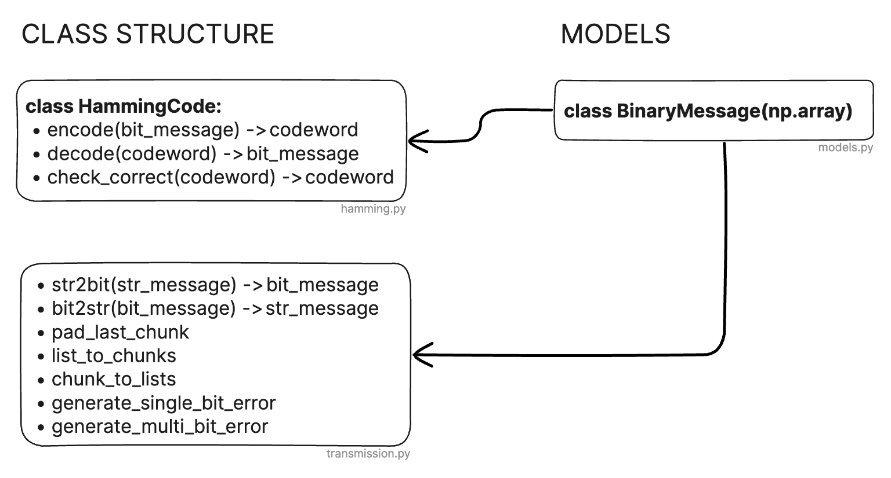

# Hamming Codes

## How to use
The notebook `main.ipynb` guides you through the project

## Theory of Hamming Code

Error detection and correction are fundamental concepts in the field of digital communications and computing, where Hamming codes play a significant role. Imagine transmitting a codeword $c$ through a noisy channel. The received vector $\tilde{c}$ might differ from $c$ due to errors introduced by the channel. To understand these errors, we define $e$ as the error vector, having 1’s at positions where errors occur. Thus, $\tilde{c} = c + e$. While simple error correction might involve repeating each bit several times and choosing the most frequent bit, linear codes offer more efficient solutions. In linear codes, the codewords form the null space of a matrix $H$. This concept simplifies error detection since $H * \tilde{c} = H * e$ gives the error syndrome. If this syndrome is zero, no error is assumed; otherwise, an error is detected. The recipient then needs to deduce $e$ from $H * e$ using the properties of the specific code being used [^1]. Note that all operations within Hamming codes are conducted in the Galois Field of Order 2, denoted as $GF(2)$. This field consists of two elements, 0 and 1, and follows rules akin to binary arithmetic without carryovers.

A codeword in Hamming codes is formed by adding $p$ parity bits to the original word. The addition of these parity bits enhances the code's ability to detect and correct errors. The number of necessary parity bits $p$ for a Hamming code with a message length $nbit$ is determined by the formula

$$
p = \min \{ p \in \mathbb{N} | 2^p - p - 1 \geq \text{nbit} \}.
$$

This formula ensures that the codeword has sufficient parity bits to handle the specified message length. The generator matrix $G \), in block matrix form, is represented as

$$
G = [ I_k | P ],
$$ 

where $I_k$ is the identity matrix of size $k$ and $P$ is a $k \times (n-k)$ matrix. The row space of $G$ contains all the codewords, and its structure ensures that each codeword includes the original message bits unaltered, but with added parity check bits for error detection and correction [^2].

The selection of parity bits in matrix $P$ starts by generating all binary vectors of size $k$. Vectors with a Hamming weight of less than 2 are filtered out, as they correspond to identity vectors, and such duplicates are not permitted in matrix $H$. Otherwise, there would be multiple possible error locations for the same error. The Hamming weight concept is defined by the number of non-zero characters in a string, which is crucial for ensuring the diversity of parity bits. Formally this can be written as:

$$
\text{wt}(\mathbf{x}) = d(\mathbf{x}, \mathbf{0}),
$$

where $\mathbf{0}$ is the zero vector (or word). $d(\mathbf{x}, \mathbf{y})$ defines the Hamming distance, which depicts the number of positions at which the symbols differ. It follows:

$$
\text{wt}(\mathbf{x}) = d(\mathbf{x}, \mathbf{0}) = 
\begin{cases} 
1 & \text{if } x \neq 0, \\
0 & \text{if } x = 0. 
\end{cases}
$$ 

The final $P$ matrix, as used in the (7,4)-Hamming Code, would be of size $4 \times 3$, with 4 message bits and 3 check bits. It would contain binary vectors with a hamming weight of at least 2:

$$
P = \begin{pmatrix}
  0 & 1 & 1 \\
  1 & 0 & 1 \\
  1 & 1 & 0 \\
  1 & 1 & 1
  \end{pmatrix}
$$

Matrix $H$ is constructed by horizontally concatenating the transpose of $P$ with an identity matrix of size $p$. Mathematically,

$$
H = [P^T | I_p].
$$

This matrix helps identify errors in the codeword through the computation of the error syndrome. The error syndrome is used to detect and (or) localize errors.

## Implementation and Code Architecture

The code structure is displayed in the Figure below. The `HammingCode` class relies on `BinaryMessage` instances to represent the messages it operates on. The `BinaryMessage` class is a subclass of `np.ndarray`, ensuring that all array functions of numpy can be used while making sure that the array strictly contains binary values, either 0s or 1s. When a new `BinaryMessage` is created, it goes through validation to ensure that all elements within the input array conform to binary values. If any element outside of the binary range is detected, the creation of the `BinaryMessage` object is aborted, and a `ValueError` is raised. This validation is critical to the integrity of the Hamming code system, as it guarantees that all messages and codewords used in the encoding and decoding processes are strictly binary, which is a fundamental requirement for the correct functioning of Hamming error-correction algorithms. The integration between these two classes enable the encapsulation and manipulation of binary data within the error correction system. The file `transmission.py` includes some functions to simulate a real world transmission, explained in \ref{chap:transmission_simulation}.

*Figure: Code structure of the Hamming code implementation. Source: own illustration.*

## Transmission Simulation [addition]
[Label: chap:transmission_simulation]

Not part of this task, we added simulated message transmission to apply the code to a real-world example by sending a string message through a noisy channel where errors can occur. Messages are converted to binary using the Hamming code and then transmitted. This step simulates the addition of parity bits and preparation of the codeword. During transmission, the codeword may be subjected to errors, simulating real-world interferences. Upon receiving the codeword, the system decodes it back to the original message. It also checks and corrects any errors if in `correct` mode or detects errors in `detect` mode. This end-to-end simulation demonstrates the robustness of the Hamming code in maintaining data integrity in noisy transmission environments. The functions used in this process are part of the `transmission.py` module.

[^1]: Reference: Klein, A. (2013). Coding Theory.
[^2]: Reference: Kythe, P. K. (2012). Algebraic Coding.
